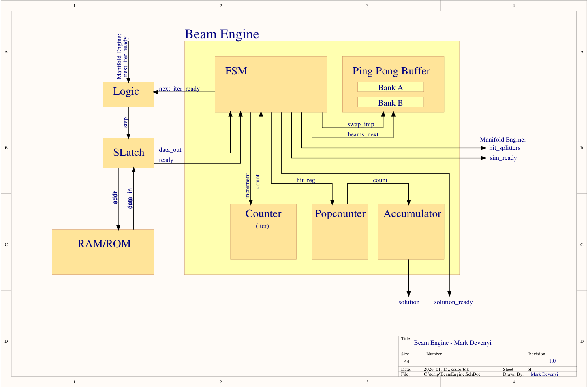
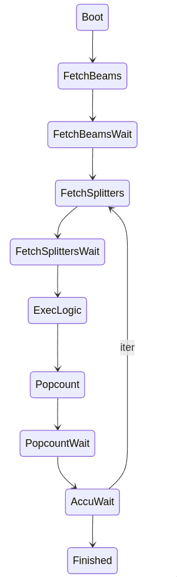
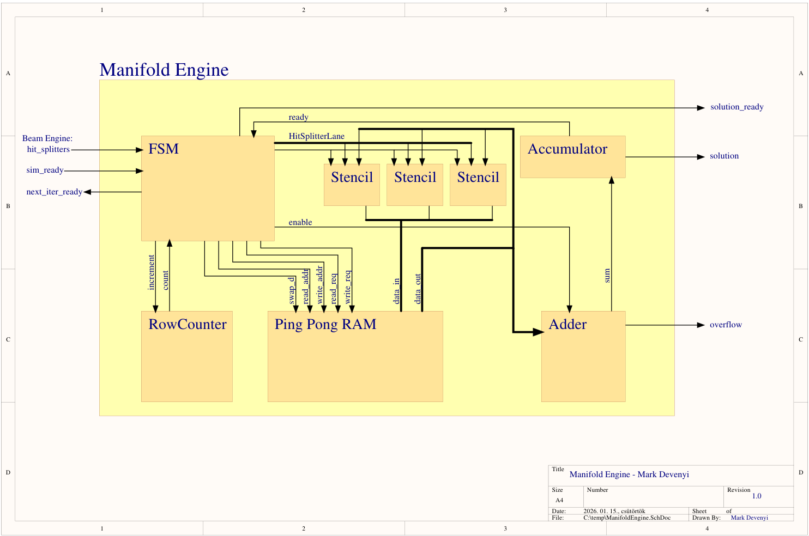
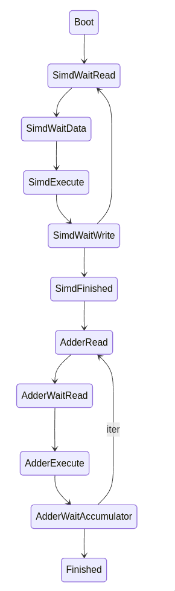

# Jane Street's Advent of FPGA 2025 Day 7 in Hardcaml

> [!IMPORTANT]
> Last allowed commit before competition deadline (Jan 16th 2026 11:59pm (UTC-5)): [80c1dd8](https://github.com/Wrench56/advent-of-fpga-2025-day7/commit/80c1dd845d1719bcdd3b72aa3ba3117230c285d9)

### Prolog: Learning OCaml and Hardcaml

This repository contains my solutions written in Hardcaml for AoC Day 7 (Laboratories).

This challenge could not have come at a better time. For quite some time, the functional programming paradigm fascinated me. Similarly, FPGA development has been on my list for quite some time. I actually did try to learn SystemVerilog during early Fall of 2025 (well, if writing things like a Barrel Shifter counts...), but I got side-tracked by another projects such as [A Baremetal Hashmap Implementation in x64 Assembly](https://github.com/Wrench56/bmhm) and [OmniRouter](https://github.com/Wrench56/OmniRouter). However, reading the challenge description, I came to get to know Hardcaml. And for the second half of my winter break, I had the pleassure to learn OCaml and Hardcaml. I do love to use OCaml syntax for wiring logic a lot more than SystemVerilog (I have to admit, my lack of experience in SV might be the reason for that) and gladly recommand it to anyone wanting to learn a new HDL language.

## Usage

If you have [direnv](https://direnv.net/) installed, and [aliases](https://github.com/direnv/direnv/issues/73#issuecomment-2824427365) set up, you can use commands `bld` (to build the libraries and executables), `tst` (to run all testbenches), `iav` (to open the interactive waveform viewer), `gen` (to generate RTL), and `verif` (to generate bitstream for the ECP5 FPGA chip and to check timing constraints). In case you do not have `direnv` installed and aliases set up, you can just build the repository using `dune build .` and run the testbenches with `dune test .`. The executables are under `_build/default/interactive/interactive.exe` and `_build/default/gen/generate.exe`. The verification tool is under `tools/verify.sh`.

## The Problem

(Restatement of [Day 7](https://adventofcode.com/2025/day/7))

### Part 1 - Standard Beams

You are given a _manifold_ (table) of a source (`S`), splitters (`^`), and empty space (`.`). A _tachyon beam_ enters the manifold at source `S` and propagates downwards through empty space until it hits a _splitter_. The splitter stops the beam and sends two tachyon beams to its immediate left and right.

The standard example Day 7 uses is the following manifold setup:

```
.......S.......
...............
.......^.......
...............
......^.^......
...............
.....^.^.^.....
...............
....^.^...^....
...............
...^.^...^.^...
...............
..^...^.....^..
...............
.^.^.^.^.^...^.
...............
```

Which evaluates to

```
.......S.......
.......|.......
......|^|......
......|.|......
.....|^|^|.....
.....|.|.|.....
....|^|^|^|....
....|.|.|.|....
...|^|^|||^|...
...|.|.|||.|...
..|^|^|||^|^|..
..|.|.|||.|.|..
.|^|||^||.||^|.
.|.|||.||.||.|.
|^|^|^|^|^|||^|
|.|.|.|.|.|||.|
```

The question we have to answer is how many times the initial beam got split.

### Part 2 - Quantum Beams

The second part changes the problem: now we have a single particle traveling through the whole manifold and it might choose to travel left or right of the splitter. We have to find out how many _timelines_ the particle has, meaning how many different combinations of travel paths exist.

## My Goals

The first HDL language I learned was Verilog back in the fall semester, and one of my favorite feature has been parameterized modules. The idea that you can quickly change implementations by setting a value here or passing a flag there seemed a powerful concept. I suspect the urge to abstract over multiple configuration "knobs" comes from my CS habits :D. [Parameterization](https://github.com/janestreet/hardcaml/blob/master/docs/module_interface.md#configuration) exists in Hardcaml as well, so I decided that I would chase a design that can be easily manipulated into taking up small area, but it will end up being "slower", or one can opt to take up a significant portion of the are in exchange for some perfromance.

This ended up working really well: The `StencilSIMD` structure can be tweaked to process more cells a cycle, the width and depth of the data can be simply changed from the Toplevel implementation, different memory latencies can be mitigated.

In other words, my design can be scaled in any direction without breaking, and you can decide to go for area or performance if needed.

## My Approach

### Part 1

A good friend of mine and I were coincidentally talking about a simple, yet fascinating game before our college winter break: Conway's Game of Life. We have an ongoing bet whether I can in reasonable time calculate a starting position n << 100 iterations before the current configuration of the game. The problem has been asked by many extremely smart people, but I certainly like playing around with the pure performance of computers. This problem prompted me to formally look into [Cellular Automata](https://en.wikipedia.org/wiki/Cellular_automaton), the field that works with automata such as Game of Life.

You might see where I am going with this: part 1 of day 7 can be interpreted as a synchronous one-dimensional cellular automata. The one-dimensional property means that to calculate the next row's beam position, we only have to know the current row's setting. This allows us to only remember the current and next rows without having to access the manifold frequently. 

Note: I might accidentally call the "current row" the "previous row" and the "next row" the "current row", for such inconsistencies, I am sorry. Semantically the two are the same, since what matters is the strict ordering: row `r` produces row `r + 1` without any other dependencies.

So let's (somewhat) formalize the math behind an iteration for part 1. The two rules we have to follow to evaluate the next cell `c` are as follows:

 * Iff the current row `r` at index `c` has a beam, next row `r + 1` also has to have a beam at `c`. (This formalizes the downward movement of the beam)
 * Iff the current row `r` at index `c` has a beam AND the cell at index `c` in the next row `r + 1` contains a splitter, then that beam does not pass straight through and instead the next row `r + 1` will contain beams at `c - 1` and `c + 1` (This formalizes the splitting of a beam).

At this point, the above formalization is technically correct but it is slightly misleading in the way I described it, because it implicitly mixes two logically separate things into a single conceptual "row array": beams and splitters. To avoid overcomplication, we should split those into two separate arrays: one that represents the dynamic beam state (as in whether in cell `c` a beam exists), and one which represents the constant manifold table (as in where the splitters are).

A convenient property of this split is the fact that now we may think of both as two bitvectors per row `r`. The array `beams` where a set bit represents the existence of a beam in some cell `c` and array `splitters` where a set bit represents the existence of a splitter in some cell `c`. Both are of width `data_width`. The `splitters` array is entirely known at compile time and is a simple constant throughout. The `beams` array is continuously evolved by the automaton.

The 0th row of the tachyon manifold containing the source `S` is excluded from the `splitters` array and included in the `beams` array as an initial condition. Essentially treat any source `S` as a beam, setting the cell of the source to a 1 in `beams`.

Now we can easily see what splitters are "hit" (meaning a beam lands on them) and what remain "unhit". The function `hit[c] = beams[r][c] AND splitters[r + 1][c]` represents whether a splitter in cell `c` of row `r + 1` will be hit or not. Similarly, `unhit[c] = beams[r][c] AND (NOT splitters[r + 1][c])` is the negated function `hit[c]`.

This is enough information to advance the automaton based on rule 1: for every cell `c` in row `r`, evaluate `unhit[c]` and set cell `c` of row `r + 1` to its result.

Now all that remains is to split the beams hitting the splitters. We know that for row `r` at cell `c` `hit[c] == 1` exactly when there was a beam directly above a splitter. The beam will be stopped and one will spawn to the left (`c - 1`) and one to the right (`c + 1`) of the splitter. Now it is simple to see that if we create an array `hit_splitters` where for each `c` we evaluate `hit[c]`, we can just shift the array by one to the left which yields are `c - 1` cells that need to be set and if we shift it to the right, we get all `c + 1` cells that need to be set.

We formalized the two rules in terms of arrays, so we can now calculate `beams[r + 1]` based on the above by using `beams[r + 1] = unhit OR (hit << 1) OR (hit >> 1)`. The elegance of this method is that the entire update step simplifies down to a simple bitwise AND, a NOT, 2 SHIFTs and 2 ORs between two bitvector of equivalent length `data_width`. It is not only extremely hardware friendly, but also extremely easy to implement.

Now that we know how to advance our automaton, we can concentrate on the actual question:

> How many times will the beam be split?

Well, notice that we already have an array that essentially encodes this information: `hit`. Every set bit in `hit` represents a split "event". So the total splits that happened are the sum of all these set bits throughout all rows. This is just the sum of popcounts, or formally:

```math
\text{total\_splits} = \sum_{r=0}^{\text{data\_depth}-2} \mathrm{popcount}\!\bigl(\text{hit}[r]\bigr)
```

Once again, this operation is very hardware friendly.

### Part 2

One can interpret part 2 as a [non-deterministic finite automaton](https://en.wikipedia.org/wiki/Nondeterministic_finite_automaton). The hard part in this case is due to the fact that each split creates 2 new beams, and each new beam can be split once again. This is exponential growth in the worst case. A complication that did not exist is in the case of overlaps: Previously, if two split beams merging into one cell it didn't give us any trouble, as we only track whether a beam is present or not as a single bit. For Part 2, we need to count how many distinct timelines "exist" in a cell, not just whether at least one beam exists, breaking our previous model. But not all is lost! This is can also be solved using automata theory! What if, instead of storing the existence of a beam, we store how many timelines the beam(s) in that cell might have? We just have to reinterpret the previous bitvector structure as an integer array of size `data_width` and as such splitting becomes integer addition and shifting. Formally, `timelines[r][c]` denotes the number of timelines in cell `c` of row `r`, replacing `beams`. Whether a splitter exists or not in cell `c` can still be kept as a bitvector, so `splitters[c]` is kept as is. The rules slightly change as follows:

* Iff the cell `c` at row `r + 1` **has no** splitters (`splitters[r + 1][c] == 0`), then the next row `r + 1` should store the number of timelines `t` of cell `c` of row `r`.
* Iff the cell `c` at row `r + 1` **has** a splitter (`splitters[r + 1][c] == 1`), then the immediate left `c - 1` at row `r + 1` should be the sum of `timelines[r][c - 1]` and `timelines[r][c]`, and similarly, the immediate right `c + 1` at row `r + 1` should be the sum of `timelines[r][c + 1]` `timelines[r][c]`. So intuitively, given a split event happens, we add to the adjacent timelines the timeline count of the beam that hit the splitter. As you can see, the logic is almost equivalent if the above is put into the format: `timelines[r + 1] = (unhit[r] * timelines[r]) + timelines[r] * (hit << 1) + timelines[r] * (hit >> 1)`. `hit` and `unhit` are essentially value masks taking the values {0, 1}, so it should be read as elementwise masking of the corresponding cell's timeline count.

The question we have to solve for is:

> In total, how many different timelines would a single tachyon particle end up on?

This can be answered fairly easily by summing the last row's (`R`) timelines:

```math
\text{total\_timelines} = \sum_{c=0}^{\text{data\_width}} \text{timelines}[R][c]
```

## Hardware Implementation

Considering my very rudimentary HDL knowledge, I started by what I know from the software world: make your own library. It was fairly simple to see what common building blocks I might need to finish this project. And honestly, considering that I have never written a line of hardcaml before, not throwing myself into deep waters seemed like a reasonable choice. After reading the [Hardcaml Manual](https://github.com/janestreet/hardcaml/blob/master/docs/index.md) (at least three times :D) and taking a look at [MIPS Implementation of Skvortsov et al.](https://github.com/askvortsov1/hardcaml-mips), I wrote the first LEGO building blocks. All of them can be found in the `src/common` directory. I had to first understand the hierarchical model in Hardcaml, which was fairly easy to pick up. Writing testbenches for such modules were also quite easy (after seeing some tricks from Skvortsov). The only thing that I wish I would have explored earlier was the interactive waveform viewer. It is hands down the best way to debug bigger logical units and its setup is well documented as well.

### Part 1

As described above, implementing the Beam Engine is fairly straightforward. We need to somehow implement an array for the beams, we can simply fetch the memory for the static beam splitters, we need a popcounter to find out the number of splits per row, an accumulator connected to the popcounter to sum up all the bits per row to one sum, a counter that is responsible for keeping track of the current row/iteration (technically this could have been unrolled), and some FSM connecting these elements together. Before I show the schematic of the design, it is necessary to return to one of the properties the part 1 automaton has: it is namely one-dimensional. This means that at any given time, the next beam row depends solely on the current one. That means we only need to keep track of two rows: the current and the next one. Therefore using a double-buffer-like mechanism would be optimal for this problem. As it turns out, double buffer is used mostly in software specific contexts, whereas ping pong buffers are their sibling in hardware contexts. The semantics of the two are similar.



For now, ignore the blocks that have a dependency on `ManifoldEngine` (such as `Logic`). In fact, my testbench for `BeamEngine` has the same setup except the logic part, as the output `next_iter_ready` of `BeamEngine` is directly connected to the `step` input of `SLatch`. Before I show the FSM table, I want to explain how I thought about the states. Most (if not all) of my components are made to be easily modifiable from combinational logic to sequential in case Fmax is too low. As such, essentially each state has a matching "Wait" state that blocks until data is ready. This ensures that ANY change in the common building blocks would never break the high-level engines. As it turned out, my `Accumulator` implementation was in critical path and I had to switch its implementation from purely combinational to a 2-staged pipeline one. Even though some states could be probably removed from the FSM, logically they are easy to follow and reason about, and as such I am reluctant to overengineer it. The following diagram shows the FSM states:



 - We begin in state `Boot` and immediately switch to `FetchBeamsWait`.
 - In `FetchBeams` we signal the `SLatch` to fetch the next memory word (initial beam source OR splitter row) from the RAM/ROM. We increment the internal counter that keeps track of the rows processed and move to `FetchBeamsWait`
 - In `FetchBeamsWait` we wait until `SLatch` has fetched the data (the memory latency of the RAM can be set manually using `memory_fetch_delay` and `memory_write_delay`) and check whether we are currently in `boot_mode`. If we are, we save the initial beam source into `hit_reg` which will be forwarded to `ManifoldEngine`, disable the `boot_mode` and signal the `ManifoldEngine` that new data is ready to be consumed. More on that later. In any case, we save the memory word in the `PingPongBuffer`, we swap banks, and we move into `FetchSplitters`.
 - In `FetchSplitters`, we either switch to `Finished` state iff the internal row counter reached the desired `data_depth`, else we signal `SLatch` that we are ready for new data, increment the internal row counter and move on to `FetchSplitterWait`
 - `FetchSplitterWait` waits until data in `SLatch` is ready to be consumed and moves on to `ExecLogic`
 - In `ExecLogic`, we calculate `hit_splitters`, output it for `ManifoldEngine`, and signal that data is ready to be consumed. We also write the next beam row back into the `PingPongBuffer` and swap banks again. We advance to `Popcount`
 - In `Popcount`, we enable the combinational `Popcounter` and advance to `PopcountWait`
 - `PopcountWait` waits until data in `Popcounter` is ready for consumption. When ready, we signal that the popcounter finished and advance to `AccuWait`.
 - `AccuWait` waits until data from the `Accumulator` is ready and jumps back to `FetchSplitter` finishing the loop. This stage adds together all the popcounts of the rows
 - In `Finished` we signal that the solution is ready for consumption

Intuitively, we fetch the initial beam source, we start fetching the static splitter rows, calculate the next row of beams based on them, accumulate the popcount of the rows, and loop until `data_depth` is reached. On top of this, we also make `ManifoldEngine`'s "life" easier by providing it the initial beam source and subsequent hit splitters.

> [!TIP]
> You can easily follow what is happening by using the `interactive` executable with the testbench `beamengine` or, in case you have [direnv](https://direnv.net/) installed, and [aliases](https://github.com/direnv/direnv/issues/73#issuecomment-2824427365) set up, you can just call `iav beamengine` for the same effect.

### Part 2

The `ManifoldEngine` heavily depends on the previously implemented `BeamEngine`. In a way, the `BeamEngine` is running the beam propagation "simulation" and we are dependent on those results (`hit_splitters` in particular) in order to effectively calculate the _quantum timelines_.

#### Stencil

One of the core logic of the `ManifoldEngine` is the block that combines the `hit_splitters` and the current timelines (`ccurr`) arrays to compute the next row of timelines (`cnext`). Apparently, in automata theory, a block that evaluates a cell based on adjacent cells with respect to some specified pattern is called a [Stencil](https://en.wikipedia.org/wiki/Iterative_Stencil_Loops). We need a stencil that evaluate the cell based on neighbors `NW`, `N`, `NE` (from [Moore neighborhood](https://en.wikipedia.org/wiki/Moore_neighborhood)). Technically, my stencils are formally three-dimensional due to the fact that we not only use `ccurr` but also `hit_splitters`, however conceptually it is easier to think of the two as overlapping arrays. The pattern is simple: Iff there is no splitter directly above the cell, the number of `N` timelines are added to the next cell's timelines. Iff `NW` has a splitter, the number of `NW` timelines are added to the next cell's timelines. Same applies for `NE`. There is a special case called `boot_mode` where we only care about the `N` `hit_splitter` value and it evaluates purely to a 0 or 1. This mode got implemented to make the saving of the initial beam source row simple.

#### StencilSIMD

You can imagine that a single `Stencil` block would take ages to compute a small `data_width` example let alone something with a width of 141 (the width of the stated problem). Therefore, the best course of action is to make a parallel lane of them. Based on [Flynn's Taxonomy](https://en.wikipedia.org/wiki/Flynn's_taxonomy), I called this a `StencilSIMD`. I am willing to bet that an experienced HDL developer would find a name way more descriptive than this, but looking at the problem from a software perception, it surely feels like a `SIMD`. The logic of the SIMD is trivial, you just have to wire in the `Stencil`-s.

The full schematic for the `ManifoldEngine` is this:



Similarly to `BeamEngine`, we have an internal row counter, the FSM logic module, a `PingPongRAM` (which is a RAM-backed version of the `PingPongBuffer`), the `StencilSIMD`, and finally an `Adder` and `Accumulator` looping through and adding the final timelines together.

Similarly to `BeamEngine`, the FSM states once again are broken into easily digestible non-complicated "action" and "wait" states:



 - We begin in `Boot`, setting up some default values, enabling `boot_mode` and transitioning to `SimdWaitData` (skipping `SimdWaitRead` which would return a uniformly zero `ccurr`)
 - In `SimdWaitRead`, we request a read from the current memory address and wait until the ping pong RAM allows read & write operations again (as changing memory address for either read or write port takes n cycles to complete) and whether `BeamEngine` finished the next `hit_splitters` calculation. Then we transitions to `SimdExecute` after
 - In `SimdExecute`, we select the SIMD window based on the iteration counter and feed both the `hit_splitter` window and the current `ccurr` output to `StencilSIMD`. Because each `Stencil` lane needs access to its immediate neighbors, the SIMD window includes a one-cell "halo" on each side. When we step the window across the row, we overlap these halos so that each lane always sees a consisten `NW`, `N`, `NE` neighborhood. Waits until the `StencilSIMD` finished the calculation (currently, the `StencilSIMD` is entirely combinational, so this explicit wait is redundant), writes the SIMD output into the ping pong RAM, sets the `overflow` register (marking whether an error happened) and transitions to `SimdWaitWrite`
 - `SimdWaitWrite` waits until the ping pong buffer finished the write operation and then checks if we reached the final iteration within the row (as in we fed all windows of the row to SIMD) and transitions to `SimdFinished` if so, otherwise increments the read and write memory addresses and the iteration counter and loops back to `SimdWaitRead`
 - In `SimdFinished`, we disable the `boot_mode` (this ensures that after the first full SIMD feeding of the initial source row finished, the `Stencil`-s return to normal computation), zero out the iteration counter, swap the ping pong RAM and zero out both of its addresses, and iff we reached the final row, transition to `AdderRead`, otherwise increment row count, signal `SLatch` using `next_iter_ready` that we are ready to consume more data and loops back to `SimdWaitRead`
 - In `AdderRead`, we request the ping pong RAM to fetch the current memory address and advances to `AdderWaitRead`
 - `AdderWaitRead` waits until the ping pong buffer fetched the `cnext` memory word and enabled the `Adder` (that sums together a memory word of the ping pong RAM in order to accumulate total number of possible timelines) and advances to `AdderExecute`
 - `AdderExecute` keeps the `Adder` enabled and waits until it finishes. Iff any of the carry bits are set, we set the `overflow` register to signal that an error happened. Then we enable the `Accumulator` (that consumes the output of `Adder` and accumulates the timelines) and advance to `AdderWaitAccumulator`
 - `AdderWaitAccumulator` waits until the `Accumulator` finished its operation. When it is ready, we check whether we just finished the final iteration within the row, and if so, we transition to `Finished` state, otherwise we increment the read address of the ping pong RAM, increment the iteration counter and loop back to `AdderRead`.

Intuitively, we loop for i iterations of rows (where the loop "body" is from `SimdWaitRead` to `SimdFinished`), inside this loop, we loop for j iterations of SIMD windows (where the loop "body" is from `SimdWaitRead` to `SimdWaitWrite`) to generate the valid final timeline counts in `cnext`. Once the nested loops are done, we loop once again for j iterations of SIMD windows (where the loop "body" is from `AdderRead` to `AdderWaitAccumulator`) to finally sum together all the final `cnext` timelines.

### Toplevel

The two engines, the RAM/ROM, the `SLatch`, and the slatch ready logic (called `Logic` on the schematic of `BeamEngine`) are connected all together in the `Top` module. The module is responsible for combining the `next_iter_ready` pulses from both `BeamEngine` and `ManifoldEngine`. Essentially, whenever the `Logic` block receives a pulse, it stores that into a register and waits until the other engine is finished with the current iteration, clearing both of these registers after a pulse to the `SLatch` requesting the next memory word (next row if you will). It also ensures that the first pulse to `SLatch` happens during boot period.

## Results

I will include a few of the result I got for my `inputs.txt`. The input width was 141, so I padded it out with 3 extra empty spaces (`.`).

### Settings

| Trial | data_width | data_depth | Maxnum part 1 | Maxnum part 2 | mem_fetch_delay | mem_write_delay | simd_width | simd_cell_width | Fmax | Cycles | Total time |
| :--- | :---: | :---: | :---: | :---: | :---: | :---: | :---: | :---: | :---: | :---: | :---: |
| Trial #1 | 144 | 142 | (2^50) - 1 | (2^50) - 1 | 0 | 0 | 9 | 44 | 69.54 MHz | 9381 cycles | 0.000106057s |

### Trial #1

```
=== top ===

        +----------Local Count, excluding submodules.
        |
     7475 wires
    54895 wire bits
     7475 public wires
    54895 public wire bits
        6 ports
       70 port bits
       37 cells
       33   $scopeinfo
        4   DP16KD
     9230 submodules
      515   CCU2C
      174   L6MUX21
     5209   LUT4
      791   PFUMX
      198   TRELLIS_DPR16X4
     2343   TRELLIS_FF

=== design hierarchy ===

        +----------Count including submodules.
        |
       37 top

        +----------Count including submodules.
        |
     7475 wires
    54895 wire bits
     7475 public wires
    54895 public wire bits
        6 ports
       70 port bits
        - memories
        - memory bits
        - processes
       37 cells
       33   $scopeinfo
        4   DP16KD
     9230 submodules
      515   CCU2C
      174   L6MUX21
     5209   LUT4
      791   PFUMX
      198   TRELLIS_DPR16X4
     2343   TRELLIS_FF

2.50. Executing CHECK pass (checking for obvious problems).
Checking module top...
Found and reported 0 problems.

2.51. Executing JSON backend.

End of script. Logfile hash: 8fed37050b, CPU: user 10.54s system 0.18s, MEM: 426.30 MB peak
Yosys 0.61+18 (git sha1 763001885, g++ 15.2.1 -march=native -O3 -fno-plt -fexceptions -fstack-clash-protection -fcf-protection -flto=auto -fPIC -O3)
Time spent: 36% 1x abc9_exe (6 sec), 23% 1x autoname (3 sec), ...


Info: Logic utilisation before packing:
Info:     Total LUT4s:      7427/83640     8%
Info:         logic LUTs:   5209/83640     6%
Info:         carry LUTs:   1030/83640     1%
Info:           RAM LUTs:    792/10455     7%
Info:          RAMW LUTs:    396/20910     1%

Info:      Total DFFs:      2343/83640     2%

Info: Packing IOs..
Info: Packing constants..
Info: Packing carries...
Info: Packing LUTs...
Info: Packing LUT5-7s...
Info: Packing FFs...
Info:     815 FFs paired with LUTs.
Info: Generating derived timing constraints...
Info: Promoting globals...
Info:     promoting clock net clock$TRELLIS_IO_IN to global network
Info: Checksum: 0x73c52058

Info: Device utilisation:
Info: 	          TRELLIS_IO:      70/    365    19%
Info: 	                DCCA:       1/     56     1%
Info: 	              DP16KD:       4/    208     1%
Info: 	          MULT18X18D:       0/    156     0%
Info: 	              ALU54B:       0/     78     0%
Info: 	             EHXPLLL:       0/      4     0%
Info: 	             EXTREFB:       0/      2     0%
Info: 	                DCUA:       0/      2     0%
Info: 	           PCSCLKDIV:       0/      2     0%
Info: 	             IOLOGIC:       0/    224     0%
Info: 	            SIOLOGIC:       0/    141     0%
Info: 	                 GSR:       0/      1     0%
Info: 	               JTAGG:       0/      1     0%
Info: 	                OSCG:       0/      1     0%
Info: 	               SEDGA:       0/      1     0%
Info: 	                 DTR:       0/      1     0%
Info: 	             USRMCLK:       0/      1     0%
Info: 	             CLKDIVF:       0/      4     0%
Info: 	           ECLKSYNCB:       0/     10     0%
Info: 	             DLLDELD:       0/      8     0%
Info: 	              DDRDLL:       0/      4     0%
Info: 	             DQSBUFM:       0/     14     0%
Info: 	     TRELLIS_ECLKBUF:       0/      8     0%
Info: 	        ECLKBRIDGECS:       0/      2     0%
Info: 	                DCSC:       0/      2     0%
Info: 	          TRELLIS_FF:    2343/  83640     2%
Info: 	        TRELLIS_COMB:    7537/  83640     9%
Info: 	        TRELLIS_RAMW:     198/  10455     1%
```
